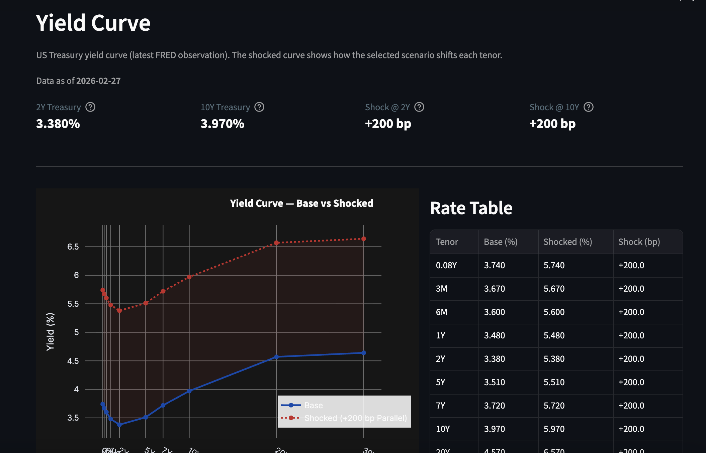
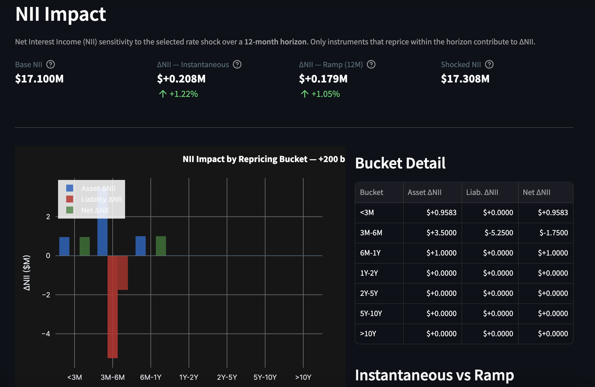
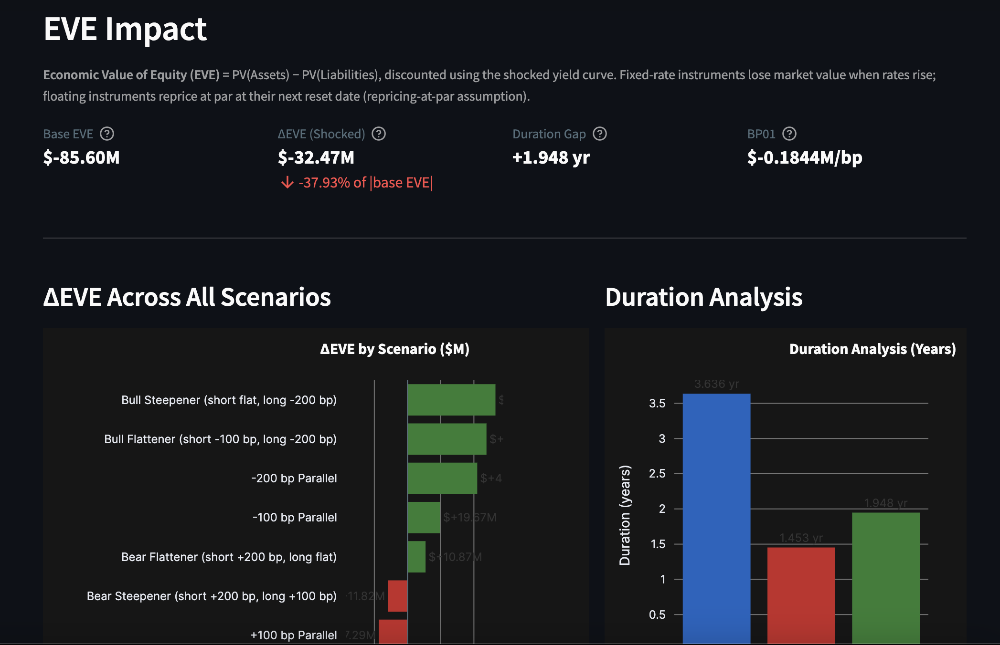
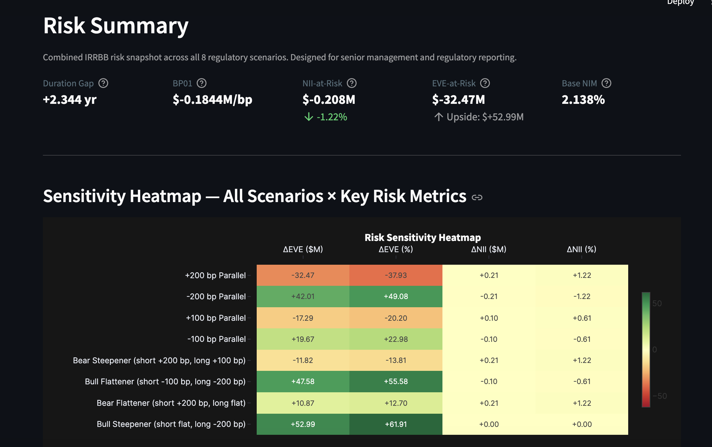

# NII / EVE Simulator

**An interactive interest rate risk dashboard for banking book analysis — NII sensitivity, EVE stress testing, and repricing gap analysis across 8 BCBS/EBA IRRBB scenarios.**

[](https://www.python.org/)
[](https://streamlit.io/)
[](https://fred.stlouisfed.org/)
[](LICENSE)

---

## What It Does

This simulator models interest rate risk in the banking book (IRRBB) for a synthetic commercial bank balance sheet. It provides:

- **NII sensitivity** — instantaneous and ramp shock impact on net interest income over a 12-month horizon, broken down by repricing time bucket and instrument
- **EVE stress testing** — discounted cash flow valuation of all balance sheet positions under shocked yield curves; computes Δ EVE, modified duration, duration gap, and BP01
- **Repricing gap ladder** — 7-bucket gap table (< 3M through > 10Y) showing the mismatch between asset and liability repricing volumes
- **8 BCBS/EBA standard scenarios** — parallel shifts (± 100 bp, ± 200 bp), Bear Steepener, Bull Flattener, Bear Flattener, Bull Steepener — applied tenor-by-tenor using IRRBB-calibrated shock profiles
- **Custom scenario builder** — per-tenor rate sliders for ad hoc analysis
- **Live market data** — yield curve fetched from the FRED API with 24-hour caching and automatic fallback

---

## Screenshots

> _Dashboard running in the browser_

| Yield Curve | NII Impact |
|---|---|
|  |  |

| EVE Impact | Risk Summary Heatmap |
|---|---|
|  |  |


---

## Installation

**Prerequisites:** Python 3.10+

```bash
git clone https://github.com/your-username/nii-eve-simulator.git
cd nii-eve-simulator
pip install -r requirements.txt
```

### FRED API Key

The simulator pulls live US Treasury yield curve data from the [FRED API](https://fred.stlouisfed.org/docs/api/fred/).

1. Register for a free API key at [fred.stlouisfed.org/docs/api/api_key.html](https://fred.stlouisfed.org/docs/api/api_key.html)
2. Open `config.py` and replace the placeholder:

```python
# config.py
FRED_API_KEY: str = "YOUR_FRED_API_KEY_HERE"
```

If the API is unavailable or the key is missing, the app automatically falls back to a hardcoded yield curve (approximate values, late 2024).

---

## Usage

```bash
streamlit run app.py
```

The dashboard opens at `http://localhost:8501`. Use the **sidebar** to:

- Navigate between the five pages
- Select a rate shock scenario (or build a custom one with per-tenor sliders)
- Click **Refresh FRED Data** to clear the cache and re-fetch the latest curve

---

## Project Structure

```
nii-eve-simulator/
│
├── app.py                    # Streamlit dashboard (5 pages, sidebar navigation)
├── config.py                 # FRED API key, scenario definitions, balance sheet defaults
├── requirements.txt
│
├── data/
│   └── fred_loader.py        # FRED API client, CSV cache (24h TTL), fallback curve
│
├── models/
│   ├── balance_sheet.py      # Instrument and BalanceSheet classes
│   ├── repricing.py          # 7-bucket gap ladder, NII impact (instant + ramp)
│   └── risk_metrics.py       # EVE via DCF, duration gap, BP01, NII scenario projection
│
├── scenarios/
│   └── rate_scenarios.py     # RateScenario dataclass, 8 shock constructors, build_scenarios()
│
└── notebooks/
    └── demo.ipynb            # Standalone walkthrough (Jupyter)
```

---

## Methodology

### Net Interest Income (NII) Sensitivity

NII measures the bank's interest income earned over a forward horizon (typically 12 months) under a stressed rate environment. For each instrument, the model identifies its next repricing event — the point at which its coupon rate will reset to market — and calculates how much additional income or cost is generated for the remainder of the horizon. Two shock timing assumptions are modelled: **instantaneous** (full shock at *t* = 0, regulatory worst-case) and **ramp** (shock builds linearly over 12 months, reflecting a gradual tightening cycle). The **uniform-distribution assumption** is applied to floating-rate instruments: since a 3M floater is equally likely to be at any point in its reset cycle, the expected time to the next reset is *R* / 2 months.

### Economic Value of Equity (EVE)

EVE is the net present value of all balance sheet positions: `EVE = PV(Assets) − PV(Liabilities)`. Each instrument's cash flows are discounted using spot rates interpolated from the shocked yield curve (annual compounding). **Fixed-rate instruments** generate coupons through to contractual maturity; rising rates reduce their present value. **Floating-rate instruments** use the repricing-at-par assumption: cash flows are modelled only to the next reset date, at which point the full principal is assumed to refinance at market rates (so they carry minimal duration risk). The model also computes **modified duration**, **duration gap** (`DA − PV_L / PV_A × DL`), and **BP01** (central-difference EVE sensitivity per 1 bp parallel shift on the base curve).

### Repricing Gap and BCBS IRRBB Context

The repricing gap is the difference between asset and liability notionals maturing or resetting within each time bucket. A positive gap (more assets than liabilities repricing) means rising rates will benefit NII in that bucket; a negative gap means rising rates will compress margins. The [Basel Committee's IRRBB standard (BCBS d368)](https://www.bis.org/bcbs/publ/d368.htm) requires banks to measure EVE and NII sensitivity under prescribed scenarios and to flag positions where ΔEVE exceeds 15% of Tier 1 capital (EVE outlier threshold). This simulator implements all eight EBA-standard shock profiles using BCBS-calibrated anchor points: a full shock plateau at tenors ≤ 2Y, a linear transition between 2Y and 10Y, and a residual shock plateau at tenors ≥ 10Y.

---

## Tech Stack

| Layer | Library / Service |
|---|---|
| Dashboard UI | [Streamlit](https://streamlit.io/) |
| Charts | [Plotly](https://plotly.com/python/) |
| Market data | [FRED API](https://fred.stlouisfed.org/) via [fredapi](https://github.com/mortada/fredapi) |
| Numerics | [NumPy](https://numpy.org/), [SciPy](https://scipy.org/) |
| Data wrangling | [Pandas](https://pandas.pydata.org/) |
| Notebooks | [Jupyter](https://jupyter.org/) |

All computation runs in-process — no database, no external services beyond FRED. The EVE engine is a pure-Python DCF implementation with linear yield curve interpolation and a 24-hour on-disk CSV cache.

---

## Key Model Assumptions

| Assumption | Detail |
|---|---|
| Cash flow frequency | Annual coupons (simplified; no day-count conventions) |
| Discounting | Annual compounding, spot rates from the US Treasury CMT curve |
| Floating instruments | Repricing-at-par: valued only to next reset; principal returned at par |
| Non-maturity deposits | Behavioural maturity applied (demand deposits: 2Y; savings: contractual 3M) |
| Rate floor | 1 bp minimum on all shocked rates (prevents numerical issues in downside scenarios) |
| Balance sheet | Synthetic ($800M assets, $900M liabilities, $100M equity); gap flagged at runtime |

---

## Note on Origin

> _Inspired by real-world ALM reporting work at a Tier-1 European bank, where NII and EVE dashboards are central deliverables for the Treasury / ALCO function. The model structure, scenario naming, and bucket conventions reflect standard regulatory practice under the EBA IRRBB guidelines._

---

## License

[MIT](LICENSE) — free to use, adapt, and extend for personal, academic, or commercial purposes.

---
*Developed by Fabian Fladischer. Built with assistance from Claude Sonnet 4.6 (Anthropic).*
